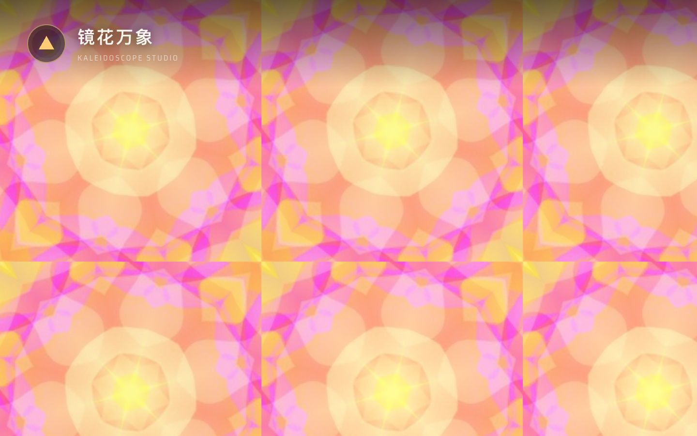

# 镜花万象 / Kaleidoscope Studio

中文：移动不同角度的三角取样章，实时生成镜像方铺、360° 放射、风车与六角错铺图案。支持本地上传和 PNG 导出。

English: Move adjustable triangular samples to generate mirrored, radial, pinwheel, and hexagonal kaleidoscope patterns live.



[在线体验 / Live Demo](https://holynova.github.io/kaleidoscope-studio/) · [GitHub Repo](https://github.com/holynova/kaleidoscope-studio)

## 本地运行 / Run locally

```bash
npm install
npm run dev
```
